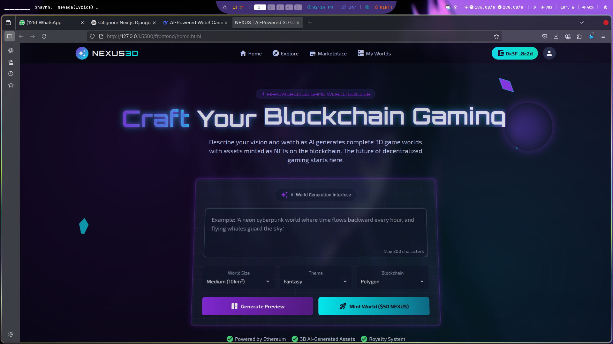

# AI-Powered On-Chain Game World Builder



## 🌍 Overview

The **AI-Powered On-Chain Game World Builder** is a revolutionary platform that combines artificial intelligence with blockchain technology to create immersive 3D game worlds. Users can describe their vision in natural language, and the AI generates complete game environments with assets that are minted as NFTs on the blockchain.

This project represents the future of decentralized game creation, offering true ownership of game assets through blockchain technology while leveraging AI to simplify the world-building process.

---

## 🚀 Key Features

- 🧠 **AI-Powered World Generation**  
  Describe your game world in natural language and watch as AI generates a complete 3D environment.

- ⛓️ **Blockchain Integration**  
  All assets are minted as NFTs on the blockchain, ensuring true ownership and verifiable scarcity.

- 🌐 **Web3 Ready**  
  Built with Ethereum blockchain integration for decentralized transactions.

- 🎮 **Immersive 3D Environment**  
  Dynamic Three.js background with floating game elements (spaceships, planets, crystals).

- 💰 **Token Economy**  
  Built-in utility token (**NEXUS**) for minting, trading, and governance.

- 🏪 **Marketplace**  
  Buy, sell, and trade AI-generated game worlds and assets.

- 🖥️ **Interactive Preview**  
  Real-time 3D preview of generated worlds with interactive controls.

- 📱 **Responsive Design**  
  Fully responsive interface that works across all devices.

---

## 🛠️ Technologies Used

### Frontend
- HTML5, CSS3, JavaScript (ES6+)
- [Three.js](https://threejs.org/) – 3D rendering library
- [GSAP](https://gsap.com/) – Animation library
- [Tailwind CSS](https://tailwindcss.com/) – Utility-first CSS framework
- Material Icons

### Blockchain
- Ethereum blockchain integration
- NFT minting functionality
- Token economy implementation

### AI Integration
- Natural language processing for world generation
- AI-powered asset creation

---

## 🧰 Getting Started

### 🔑 Prerequisites
- Modern web browser (Chrome, Firefox, Safari, Edge)
- Internet connection

### 📦 Installation

No installation required! Simply open the `index.html` file in your browser to run the application.

For development:

```bash
# Clone the repository
git clone https://github.com/axiomchronicles/onchain-game-world-builder.git

# Navigate to the project directory
cd onchain-game-world-builder

# Open index.html in your browser
```

---

## 💡 How to Use

1. **Describe Your World**  
   - Enter a description of your game world (e.g., *"A neon cyberpunk world where time flows backward every hour"*)  
   - Select world size, theme, and blockchain

2. **Generate Preview**  
   - Click **Generate Preview** to see a 3D visualization

3. **Mint Your World**  
   - Click **Mint World** to create an NFT on the blockchain  
   - Pay using NEXUS tokens (simulated in demo)

4. **Explore Marketplace**  
   - Browse and trade AI-generated worlds  
   - Place bids on featured worlds

5. **Manage Your Assets**  
   - View your minted assets in **My Worlds**  
   - Edit or resell your creations

---

## 📁 Project Structure

```
ai-game-world-builder/
├── index.html          # Main application file
├── README.md           # Project documentation
├── assets/             # Static assets
│   └── screenshot.jpg  # Project screenshot
├── features/           # Detailed feature documentation
└── license/            # License information
```

---

## 🔮 Future Enhancements

- Integrate with real blockchain networks (Ethereum, Polygon)
- Implement wallet connection (MetaMask, WalletConnect)
- Add backend API for AI processing
- User accounts and profile management
- Full 3D editor for generated worlds
- Multiplayer functionality
- VR/AR compatibility
- Mobile application version

---

## 📄 License

This project is licensed under the **MIT License** – see the [LICENSE](license/) file for details.

---

## 🤝 Contributing

Contributions are welcome!  
Follow these steps:

```bash
# Fork the project

# Create your feature branch
git checkout -b feature/AmazingFeature

# Commit your changes
git commit -m 'Add some AmazingFeature'

# Push to the branch
git push origin feature/AmazingFeature

# Open a pull request
```

---

## 🙏 Acknowledgements

- [Three.js](https://threejs.org/) for the 3D rendering engine  
- [GSAP](https://gsap.com/) for smooth animations  
- [Tailwind CSS](https://tailwindcss.com/) for the modern styling  
- Ethereum community for pushing Web3 innovation  
- AI researchers for enabling generative content